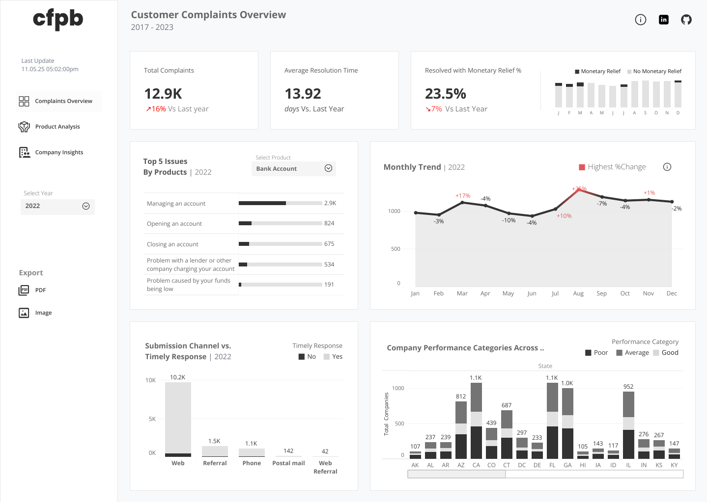
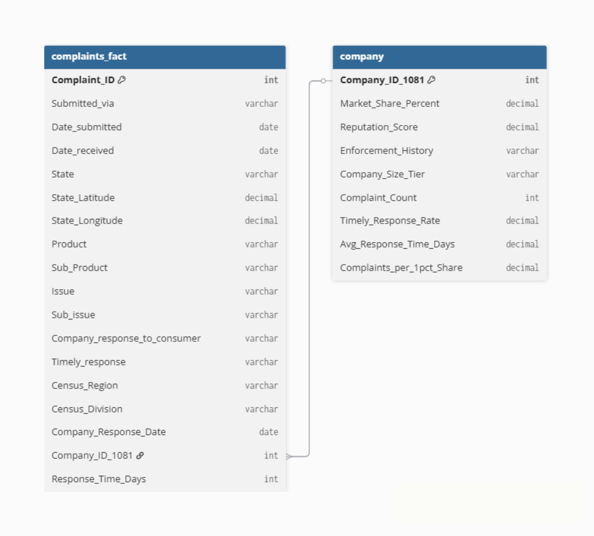

# Customer Complaints Overview Dashboard

The Consumer Financial Protection Bureau (CFPB) collects and publishes consumer complaints about financial products and services in the U.S. This dashboard visualizes those complaints to provide an analytical view of how different companies and financial products perform in addressing consumer issues. The goal is to promote transparency and help identify patterns that may indicate potential risks or service gaps.

## Tools and Technologies

- **Tableau Public** | Dashboard creation, data visualization, KPI tracking
- **Excel** | Data cleaning, missing value imputation, date serial conversion
- **CFPB Dataset** | Consumer complaint data source 

## Dashboard Preview

?? **View the Interactive Dashboard Here:**  
 [Customer Complaints Overview Dashboard on Tableau Public](https://public.tableau.com/app/profile/daren.dale.aldea/viz/CustomerComplaintsOverview_17623364235470/CustomerComplaintsOverview)

## I. Business Context

The Consumer Financial Protection Bureau (CFPB) serves as the primary U.S. government agency responsible for protecting consumers in the financial marketplace. Each year, it receives hundreds of thousands of complaints from consumers regarding financial products and services such as credit cards, mortgages, bank accounts, and loans. These complaints provide critical insights into the performance, transparency, and accountability of financial institutions.

However, the raw CFPB data is extensive and complex, containing tens of thousands of records with varying products, issues, and company responses. Without proper transformation and visualization, the data’s true insights remain hidden from key decision-makers.

This project was developed to bridge that gap by transforming raw CFPB complaint data into an interactive Tableau dashboard that supports data-driven decision-making for stakeholders, including:

- **Regulators and policymakers** – to monitor complaint trends, assess company responsiveness, and identify emerging issues that may require regulatory action.
- **Financial companies and management** – to evaluate performance, customer satisfaction, and operational efficiency across products and regions.
- **Data analysts and researchers** – to conduct time-based, product-based, and geographic analyses for better understanding of consumer protection outcomes.

Ultimately, the project enhances transparency, accountability, and customer advocacy, aligning with the CFPB’s mission to ensure fair treatment and effective redress mechanisms for all financial consumers.

Key questions remained unanswered: 
Which products generate the most consumer complaints? How effectively are companies resolving these complaints? Which submission channels lead to faster responses? Are certain states or company categories performing better or worse? How do year-over-year complaint trends reflect consumer trust and protection effectiveness?

## II. Dataset Summary

| Attribute | Details |
|------------|----------|
| **Source** | CFPB Public Data (Sample for Analysis) |
| **Sheets** | Complaints (Fact), Company, Data Dictionary |
| **Main Analyzed Sheet** | Complaints (Fact) |
| **Rows** | 62,516 |
| **Columns** | 19 |
| **Duplicates** | None found |

## III. Data Understanding and Preprocessing

### Data Structure & Key Fields
- Identifiers, categorical fields (e.g., *Product, Issue, Company*), numeric metrics (*Response_Time_Days*), and geospatial columns (*State, Latitude, Longitude*).
- Date fields stored as Excel serial numbers (e.g., `44493`) converted into proper calendar dates for time-series analysis.

### Data Cleaning Steps
**Missing Data Handling**
- `Sub-issue`: 10,858 missing values (17.36%) ? Filled using **mode imputation** based on the most frequent Sub-issue within each *(Product, Sub-product, Issue)* group.  
- `Company public response`: 3.48% missing ? Dropped due to irrelevance to the analysis goal.  
- `Timely response?`: Blanks replaced with **"In Progress"** to reflect unresolved complaints.

**Feature Validation**
- Verified unique `Complaint ID` (62,516 unique values).  
- Checked cardinality of `State` and location fields — 51 unique U.S. states and territories.

## Entity Reltionship Diagraam

## IV. Dashboard Design and Features

#### Purpose
To analyze and visualize **consumer complaint trends**, **company responsiveness**, and **issue categories** over time, enabling a data-driven view of consumer protection and satisfaction.

#### Main KPIs

- **Total Complaints** | Total number of complaints received during the selected year.
- **Average Resolution Time (Days)** | Average duration from complaint receipt to company response.
- **% Resolved with Monetary Relief** | Share of complaints resulting in financial compensation.

#### Key Visual Components
- **Top 5 Issues by Product** — Displays the most common consumer issues per product (e.g., “Managing an Account”).  
- **Monthly Complaint Trend** — Time-series line graph of monthly complaint volumes and % change.  
- **Submission Channel vs Timely Response** — Compares submission channels (Web, Phone, Referral) and response timeliness.  
- **Company Performance Across States** — Stacked bar chart showing complaint volume and company performance (Good, Average, Poor).  

## V. Insights and Findings

#### Key Observations
- **Complaint Volume:** The higest volume of complaints ~12.9K were recorded in 2022 ? **+16% increase** vs. previous year.  
- **Resolution Time:** Avg. **13.92 days**, slightly slower than last year.  
- **Monetary Relief:** **23.5%** of complaints received compensation ? **7% decline** YoY.  

#### Most Frequent Issues
- “Managing an Account” and “Opening an Account” are top recurring issues almost annually.

#### Submission Patterns
- **Web** channel = majority (~10.2K complaints), but not all responded to timely.

#### Regional Trends
- States like **California** and **Florida** recorded higher complaint counts, often linked to **average–poor** company performance.

## Analytical Concepts Used

- **Mode Imputation** for missing categorical data.  
- **Date Conversion & Parsing** for time-based analysis.  
- **Normalization Metric:** *Complaints per 1% Market Share* — for fair company comparison.  
- **Ranking & Filtering Logic** — Top 1 Issue, Sub-Product, and Sub-Issue per Product.  
- **Parameter Controls** — Dynamic filtering by product and year.

## Insights Interpretation

- Rising complaint volume + slower resolution ? potential **operational bottlenecks**.  
- Low monetary relief rates ? **non-financial resolutions dominate**.  
- Web submission dominance ? need for **improved digital response systems**.  
- Companies with high volume of poor performing category ? **reputation risk** indicators.

## VI. Recommendations and Future Analysis

### Recommendations
- **Improve response efficiency:** Automate complaint triage to cut resolution time.  
- **Enhance digital touchpoints:** Strengthen web-based consumer support.  
- **Prioritize top issues:** Focus on recurring problems like account management.  
- **Regional targeting:** Launch awareness campaigns in high-complaint states.

###  Future Enhancements
- Integrate **sentiment analysis** on complaint narratives.  
- Correlate **company reputation** with complaint patterns.  
- Add **market share** & **financial metrics** for benchmarking.  
- Build **geospatial heatmaps** for complaint intensity.  
- Apply **trend forecasting models** for proactive insights.

## VII. Reflection

This project strengthened my ability to:
- Design and implement an **end-to-end data visualization pipeline** — from cleaning and transformation to storytelling in Tableau.  
- Apply **data quality checks** and imputation techniques on large datasets.  
- Communicate **regulatory and consumer insights** visually and intuitively.

> Ultimately, this dashboard empowers stakeholders to monitor company responsiveness, improve consumer satisfaction, and ensure accountability in the financial sector.

> Project Published: November 05, 2025
