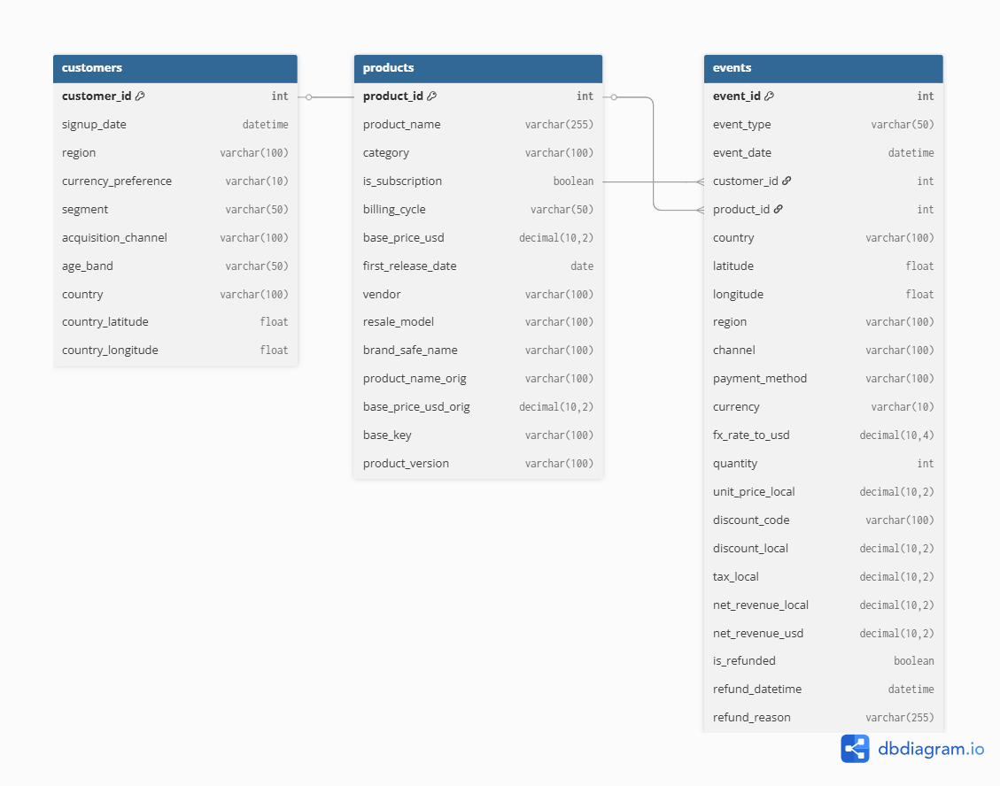
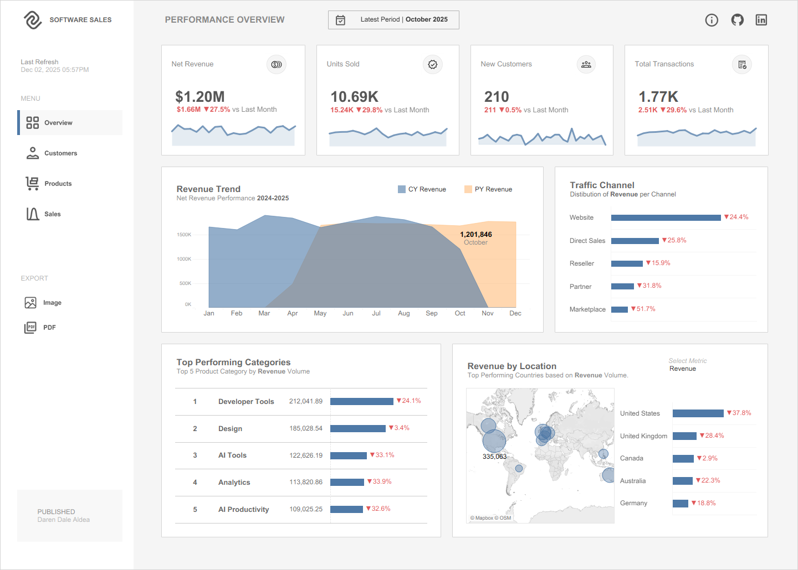
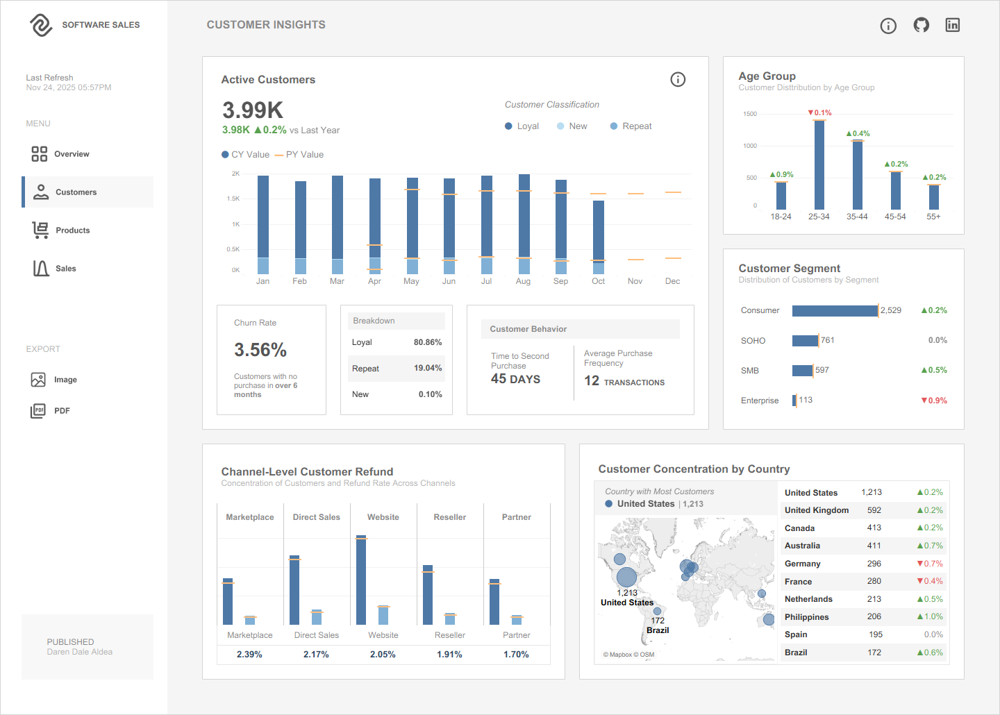
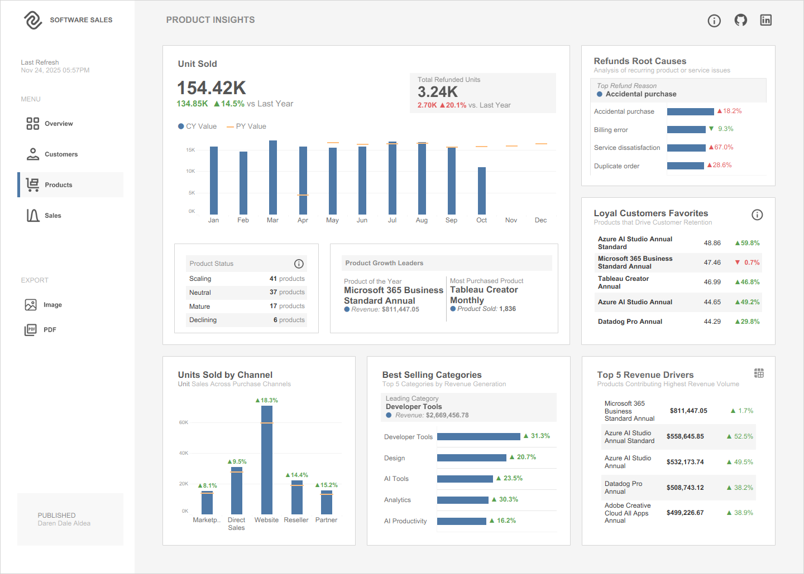
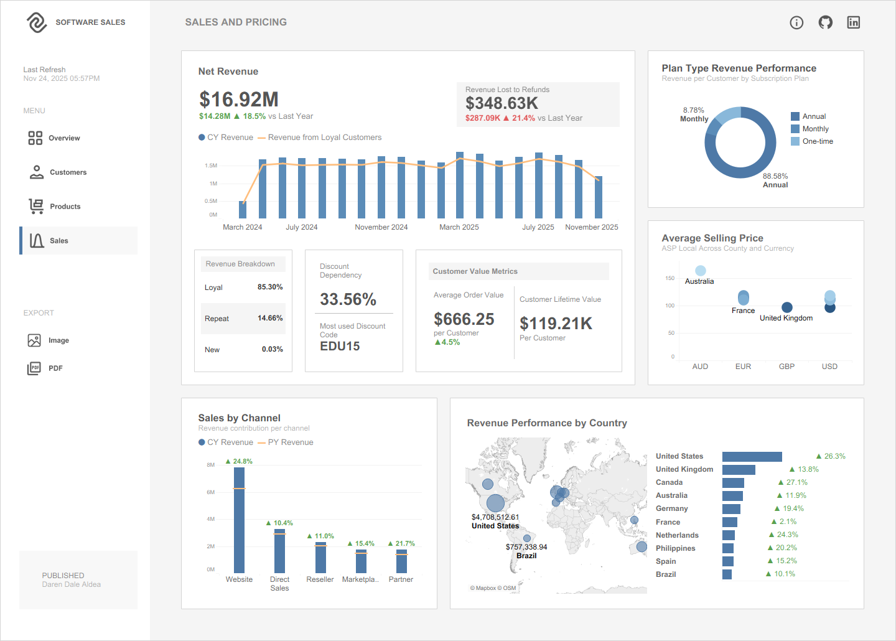

# Global Software Sales Analytics
*Data Visualization & Business Insights using Tableau*

## I. Executive Summary

This project focuses on analyzing the commercial performance of a global software e-commerce business. Using Tableau, the analysis explores revenue trends, customer behavior, product performance, pricing impact, refunds, and channel-level contributions across multiple regions and product lines.
The final output is a multi-page interactive dashboard enabling stakeholders to monitor sales performance, evaluate retention behavior, identify opportunities for growth, and support data-driven strategic decision-making.

## II. Business Objectives

- Tracks sales and loyal-customer volumes over time.
- Highlights revenue drivers and repeat-purchase patterns.
- Shows how discounts and pricing influence sales performance.
  

The analysis addresses core business questions:

- How are revenue and product sales trending over time?
- Which channels bring in the most sales?
- Which channels bring the most repeat (loyal) customers?
- What percent of monthly sales comes from loyal customers?
- Which products or plans sell the most?
- Which products are most popular with loyal customers?
- How long do customers wait before their second purchase?
- Which discount codes are used most, and do they increase repeat purchases?
- What is the average selling price (ASP) by country or currency?
- Where do refunds happen most (by product or channel)?
- Do annual plans bring higher revenue per customer than monthly plans?

## III. Dataset Description

The dataset was provided by the Onyx Data - Data repository that simulates transactional behavior within a global software marketplace. It includes subscription-based and one-time purchases across multiple categories including AI tools, analytics, design, developer tools, and productivity products.

**Entity Relationship Diagram**

Relationships exist between customers → products → events, forming the foundation for segmentation, retention analysis, pricing evaluation, and sales performance.

## IV. Data Preparation

- Standardized date and numeric types (revenue, price, tax fields).
- Handled nulls and duplicates; documented assumptions and limitations.
- Created derived fields: `LoyalCustomer` flag, `CustomerLifetime`, `TimeToSecondPurchase`, `DiscountApplied`, `ProductLifecycleStage`, `RefundFlag`, `ASP` (average selling price) and the rest in-depth exploration.
- Aggregations for monthly/yearly comparisons and YoY trend calculations.

## V. Exploratory Data Analysis (EDA)

Initial EDA focused on identifying:
- Revenue concentration by channel and geography
- Customer classification and behaviour
- Subscription growth behavior
- Customer churn and retention drivers
- Product lifecycle momentum and performance divergence
- Discount dependency and price elasticity tendencies

## VI. Dashboard Structure

This Tableau project contains four dashboard sections:

### A. Performance Overview Dashboard

Provides a consolidated, high-level view of the company’s commercial performance for the latest reporting period. It is designed to help stakeholders quickly assess revenue health, sales volume movement, customer acquisition, and channel efficiency.

## Key Metrics

- Net revenue, units sold, transactions
- New customers, active customers
- Revenue trend (MoM / YoY)
- Channel & category performance
- Country-level performance map

## Top-line Insight

- Month net revenue: **$1.20M** (down from $1.66M prior month). Broad decline across channels with Marketplace underperforming.

  
## Recommended Actions

- Investigate Marketplace funnel and merchant listing quality
- Run quick-win retention campaigns for at-risk segments

## B. Customer Insights Dashboard

The Customer Insights Dashboard provides a comprehensive view of customer activity, behavior, and distribution for the current period. Its purpose is to help the organization understand customer retention, engagement patterns, demographic composition, channel-level performance, and geographic concentration. By visualizing churn, loyalty trends, and refund rates, this dashboard supports strategic decisions in customer experience improvement, retention programs, and targeted marketing.

## Key Metrics

- Active customers, customer categorization, churn rate, loyal customer %  
- Time to second purchase (avg: **45 days**)  
- Customer concentration by country, channel segments

### Top-line Insight

- Loyal customers account for **~80.9%** of the active base. Time-to-repurchase offers a 30–40 day re-engagement window.

## Recommended Actions
- Trigger targeted outreach 30–40 days after first purchase
- Localize campaigns for countries with declines (e.g., Germany, France)

## C. Product Insights Dashboard

The Product Insights Dashboard provides a comprehensive view of product performance across sales volume, refund behavior, category contribution, customer retention drivers, and revenue generation. Its purpose is to help stakeholders identify high-performing products, understand growth patterns, monitor refund drivers, and evaluate channel effectiveness.

## Key Metrics

- Units sold, refunded units, product lifecycle stage, retention score
- Top products among loyal customers, category momentum

## Top-line Insight
- Units sold up **14.5% YoY**, but refunds rose - most common reason: accidental purchases and increased service dissatisfaction.

## Recommended Actions
- Improve checkout confirmation and billing workflows
- Prioritize UX fixes and support for products with rising dissatisfaction

## D. Sales Performance Dashboard

A consolidated analysis of sales and pricing performance across channels, customer types, subscription plans, and geographic markets. The objective is to monitor revenue performance trends, evaluate customer value, assess pricing effectiveness, and identify opportunities for growth and optimization. The data includes year-over-year comparisons, revenue distribution, customer loyalty metrics, and channel-level contribution insights.

## Key Metrics

- Yearly sales trends
- Channel contribution (Website, Partner Sales, Direct Sales)
- Revenue by geography (mapped visualization)
- Purchase patterns by currency and billing cycle

## Top-line Insight

- YoY net revenue: **+18.5%**, with >85% from loyal customers. Promo dependency ≈ **33.6%**, indicating price sensitivity.

## Strategic Recommendations

- Strengthen Customer Acquisition Efforts: Invest in targeted marketing campaigns focusing on underpenetrated regions with emerging growth.
- Introduce satisfaction-based support programs and product education resources to prevent cancellations and returns.
- A/B test pricing models for monthly vs annual plans to reduce discount sensitivity.
- Improve partnership engagement and performance tracking for reseller and marketplace frameworks.
- Localize payment options and pricing for growing markets such as Australia, Philippines, and Spain.

## VII. Key Findings Summary

| Area | Summary |
|---|---|
| Customer behavior | Strong loyal base but early lifecycle retention needs improvement. |
| Product sales | Subscriptions (analytics/dev tools) drive top revenue. |
| Pricing | Heavy discounting improves conversion but compresses margins. |
| Geography | Concentrated in US/UK/Canada; growth in select emerging markets. |
| Channel | Website & direct high-performing; marketplace needs attention. |
| Refunds | Most refunds occur early; primary causes: accidental orders, service dissatisfaction. |

## VIII. Recommendations for the Business

1. Reduce first-month churn: targeted onboarding & 30–40 day re-engagement.  
2. Reduce refund friction: improve checkout confirmations and post-purchase support.  
3. Reassess marketplace strategy: product listings, merchant SLAs, and refund policies.  
4. Pricing optimization: elasticity modeling & A/B tests for discounts vs bundles.  
5. Invest in high-ARPU channels (direct enterprise) and localize pricing for growing markets. 

## IX. Recommendations and Future Analysis

- Build predictive models (churn probability, refund risk, revenue forecasting).  
- Perform price elasticity modeling per-region & product category.  
- Implement cohort & funnel analyses for onboarding flows.  
- Add product usage telemetry to refine segmentation and LTV estimates.

## X. Conclusion

This analysis was conducted to understand the business' commercial performance. Through comprehensive exploration of customer behavior, channel efficiency, and product performance, the most significant insight revealed that the decline is driven largely by channel underperformance, particularly in the Marketplace and increasing dependency on discounts, which impacts both revenue stability and long-term margin health. Additionally, rising refund rates tied to accidental purchases and service dissatisfaction signal friction points in the purchase and product experience.

The findings provide a clear direction for the business to act: optimize high-performing channels while improving weaker acquisition paths, reduce discount reliance by improving value perception, strengthen onboarding to prevent early churn, and enhance product support to reduce dissatisfaction-related refunds. Addressing these areas will allow the organization to stabilize revenue trends, improve customer lifetime value, and support sustainable growth across global markets.

## Tools & Skills Demonstrated

- **Tableau Desktop** - Data Visualization & Dashboard Design
- **Microsoft Excel** - Cleaning, Formatting & Exploration (Data Dictionary)
- **ChatGPT** - AI-Assisted Insight Validation and Documentation Support
- **Business Intelligence Storytelling**
- **Data Storytelling & KPI Frameworks**
- **Business Analytics & Decision Insights**
  
---

🔗 **View the Interactive Dashboard Here:**  
 [Global Software Retail Analytics on Tableau Public](https://public.tableau.com/app/profile/daren.dale.aldea/viz/SoftwareRetailAnalytics/d1_PerformanceOverview)

> Project Published: December 06, 2025
